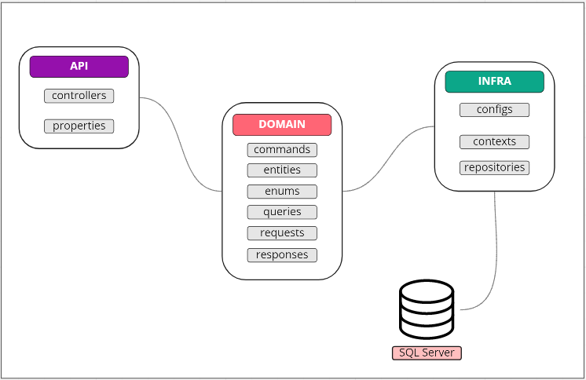
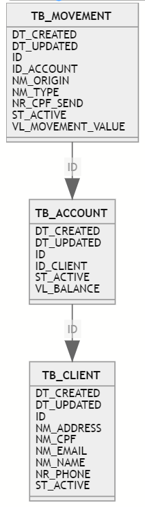

# API XBank 

## Descrição
API desenvolvida como Projeto Final para a conclusão do curso de .NET da [XP Inc.](https://www.xpi.com.br/) em parceria com a [GamaAcademy](https://www.gama.academy/)

### Sumário
==================

- [Proposta do projeto final](#Proposta-do-projeto-final)
- [Regras de negócio](#Regras-de-negócio)
- [Arquitetura](#Arquitetura)


### Proposta do projeto final 
Construção de uma API com arquitetura REST para gerenciar as transações da nossa instituição bancária, o **XBank**. Capaz de executar um CRUD, as quatro operações básicas usadas em Banco de Dados Relacionais - Create (Criação), Read (Consulta), Update (Atualização) e Delete (Destruição), em um banco de dados NoSQL.

### Regras de negócio
#### Cliente
```hs
- Quando um cliente é cadastrado imediatamente está ativando e se vinculando a uma conta.
- Um cliente ao ser atualizado/desativado a sua conta será afetada.
- Não será possível cadastrar um cliente com CPF já cadastrado.
- Todos os dados cadastrais solicitados são obrigatórios.
``` 

#### Conta
```hs
- Uma conta só pode ser criada quando um cliente é cadastrado.
- Quando atualizar/desativar uma conta o cliente vinculado será afetado.
- Permitido apenas uma conta por CPF.
- Uma solicitação de cancelamento não deleta a conta e dados do cliente do banco, apenas desativa,  permanecendo todos os dados no banco de dados.
- O Saque deve conter a data e hora de quando foi realizado e o valor.
```

#### Movimentação
```hs
- Saque por cliente ilimitado.
- É possível realizar o histórico de movimentações por conta.
- Não será possível fazer movimentações negativas e nem superiores ao saldo da conta.
- Para realizar movimentação é necessário CPF de destino.
- A movimentação está vinculada a uma conta.
- Movimentações disponíveis saque, transferencia e depósito.
- No extrato ficará disponibilizado para o cliente a data e a hora das movimentações.
```

### Arquitetura
        Arquitetura REST
        |
        \--📂 **HUB-FIGHTS**
            | 📄 README.md
            | 📄 .gitignore
            | 📄 **XBank.sln**  
            \--📂 .vs
            \--📂src  
                📂---Domain
                        |📄 **Core.csproj**
                            📂---Commands
                            📂---Entities
                            📂---Enums
                            📂---Queries
                            📂---Requests
                            📂---Responses
                    |   📄 **Shared.csproj**
                            📂---Entities
                            📂---Handlers
                            📂---Interfaces
                            📂---Util
                            📂---ValueObjects  
                📂---Infra
                    |   📄 **Infra.cspro**
                            📂---Configs
                            📂---Contexts
                            📂---Repositories
                📂---Service
                    |   📄 **API.**
                            📂---Properties
                            📂---Controllers
                            | 📄 appsettings.json
                            | 📄 Program.cs
                            | 📄 Startup.cs
                            | 📄 WeatherForecast.cs
                            
## Fluxograma da API 

<p align="center"></p>

##  Links
#### local: http://localhost:52227
#### API: https://localhost:5001; http://localhost:5000

## Iniciando aplicação
- Use o comando `dotnet build` para compilar o projeto
- Após a compilação use o comando `dotnet run` para inicializar a aplicação

## Rotas e modelos com campos obrigatórios para teste

##  - Account
####  `POST`
**​/api​/Account​/{id}**
```js
{
  "movementValue": 0,
  "cpfSend": "string",
  "type": 1
}
```
####  `GET`
**​/api​/Account​/{id}**


## - Client
####  `POST`
**Rota:**   */api/Client* 
```js
{
  "name": "string",
  "email": "string",
  "address": "string",
  "phone": "string",
  "cpf": "string"
}
```

####  `GET`
**​/api​/Client**

####  `PUT`
**​/api​/Client​/{id}**
```js
{
  "name": "string",
  "email": "string",
  "address": "string",
  "phone": "string"
}
```
####  `DELETE`
**​/api​/Client​/{id}**

####  `GET`
**​/api​/Client​/{id}**

##  Schemas SQL
<p align="center"></p>

## Futuras implementações:
 - Criação de avaliação de perfil, importante para ofertar novos produtos do banco
 - O cliente poderá ter vários tipos de conta vinculados como (Pessoa Jurídica, conta poupança)
 - Limite de saque por dia
 - Implementação de login e senha para acesso a conta e movimentações
 - Tokenização, aumentando a segurança das movimentações
 - Implementação de Testes unitários

##  Organização do Projeto:
#### [Miro](https://miro.com/app/board/o9J_lmihxys=/?invite_link_id=73148829103)
#### [Apresentação Canvas](https://www.canva.com/design/DAEvWuTP9X4/xSjWeqm4U6Dmsh2MSvwhZA/view?utm_content=DAEvWuTP9X4&utm_campaign=designshare&utm_medium=link&utm_source=publishsharelink)

## Equipe:
#### [Gaciela Nonato](https://www.linkedin.com/in/gracielalopes/)
#### [Lilian Teixeira](https://www.linkedin.com/in/lilianhteixeira/)
#### [Simoni Accioly](https://www.linkedin.com/in/simoniaccioly/)
#### [Tassila Bomfim](https://www.linkedin.com/in/tassilabomfim/)
#### [Vitor Conceicao](https://www.linkedin.com/in/vitorrodrig/)

<br>

> A plataforma foi desenvolvida como Projeto Final para a conclusão do curso de .NET da [XP Inc.] em parceria com a [GamaAcademy] e todos os dados foram tratados de maneira fictícia.

                            
